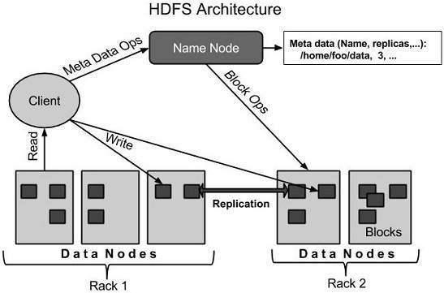
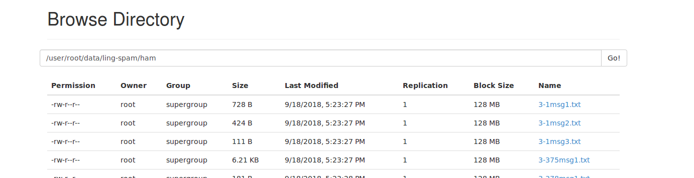

# HDFS in Apache Spark

In this project, we will investigate Hadoop HDFS and It's usage in Apache Spark.


## 1. What is HDFS?

Hadoop File System was developed using distributed file system  design. It is run on commodity hardware. Unlike other distributed  systems, HDFS is highly faulttolerant and designed using low-cost  hardware.

HDFS holds very large amount of data and provides easier access. To  store such huge data, the files are stored across multiple machines.  These files are stored in redundant fashion to rescue the system from  possible data losses in case of failure. HDFS also makes applications  available to parallel processing.

### Features of HDFS

- It is suitable for the distributed storage and processing.
- Hadoop provides a command interface to interact with HDFS.
- The built-in servers of namenode and datanode help users to easily check the status of cluster.
- Streaming access to file system data.
- HDFS provides file permissions and authentication.


### HDFS Architecture

Given below is the architecture of a Hadoop File System.



HDFS follows the master-slave architecture and it has the following elements.

### Namenode

The namenode is the commodity hardware that contains the GNU/Linux operating system and the namenode software. It is a software that can be run on commodity hardware. The system having the namenode acts as the master server and it does the following tasks:

- Manages the file system namespace.
- Regulates client’s access to files.
- It also executes file system operations such as renaming, closing, and opening files and directories.

### Datanode

The datanode is a commodity hardware having the GNU/Linux operating system and datanode software. For every node (Commodity hardware/System) in a cluster, there will be a datanode. These nodes manage the data storage of their system.

- Datanodes perform read-write operations on the file systems, as per client request.
- They also perform operations such as block creation, deletion, and replication according to the instructions of the namenode.

### Block

Generally the user data is stored in the files of HDFS. The file in a file system will be divided into one or more segments and/or stored in individual data nodes. These file segments are called as blocks. In other words, the minimum amount of data that HDFS can read or write is called a Block. The default block size is 64MB, but it can be increased as per the need to change in HDFS configuration.
Goals of HDFS

- Fault detection and recovery : Since HDFS includes a large number of commodity hardware, failure of components is frequent. Therefore HDFS should have mechanisms for quick and automatic fault detection and recovery.
  
- Huge datasets : HDFS should have hundreds of nodes per cluster to manage the applications having huge datasets.
  
- Hardware at data : A requested task can be done efficiently, when the computation takes place near the data. Especially where huge datasets are involved, it reduces the network traffic and increases the throughput.


## 2. Start HDFS in Docker Container

to start a HDFS in docker container, these steps can be covered:

1. Make a `docker-compose.yml` file like this:

   ```yaml
   version: '2.0'  
   services:  
     myHDFS:
       image: sequenceiq/hadoop-docker:2.7.0
       container_name: myHDFS
   
       ports:
         - '50070:50070'
         - '8020:8020'
         - '9000:9000'
   
       volumes: 
         - ./raw_data/:/usr/local/hadoop/raw_data
   ```

   - Port `50070` is used for Hadoop HDFS WebUI
   - Port `9000` is used for hdfs Api which we will use it in apache spark
   - Volume is used to put our data into HDFS container

2. Run bellow command to connect to the container:

   ```shell
   $ sudo docker -t exec myHDFS  bash
   ```

3. Go to hadoop home by this command:

   ```shell
   $ cd HADOOP_PREFIX
   ```

   

4. Now you can use hadoop hdfs commands to put, get, ls and other useful commands to get or put information in HDFS filesystem. For example:

   - list of hdfs files:

     ```shell
     $ bin/hadoop fs -ls
     ```

   - Make directory

     ```
     $ bin/hadoop fs -mkdir test
     ```

     

   - Put data into HDFS

     ```shell
     $ bin/hadoop fs -put /usr/local/hadoop/raw_data/ling-spam test/
     ```

   - Get data from HDFS

     ```shell
     $ bin/hadoop fs -get test/ /usr/local/hadoop/raw_data/ling-spam
     ```

   

   ## 3. Browse data in WebUI

   You can browse data in WebUI by this procedure:

   1. Browse this URL:

      ```
      localhost:50070
      ```

   2. Go to "Browse the file system" in "Utilities" menu:

      

   3. Enter your desired path and see the result:

      

> Note: if you have made a folder named "data" in HDFS, it would be accessible through "/user/root/data"


## 4. Access HDFS files in Apache Spark

You may access HDFS files in apache spark without need to any driver and directly like this:

- Create RDD from text files:

  ```scala
  val myFile = sc.textFile("hdfs://192.168.88.52:9000/user/root/data/ling-spam/ham/3-384msg1.txt", minPartitions = 10)
  ```


## 5. TODO

- Persist docker container HDFS data
- How to cluster hadoop hdfs

